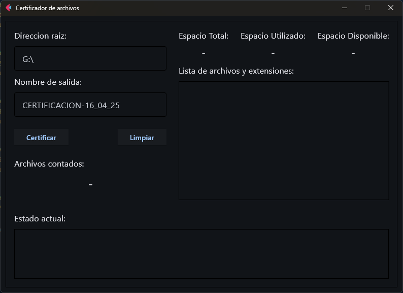
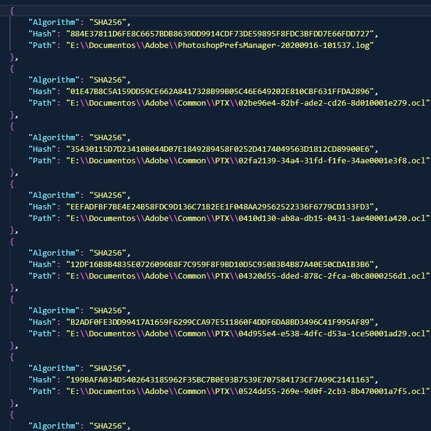
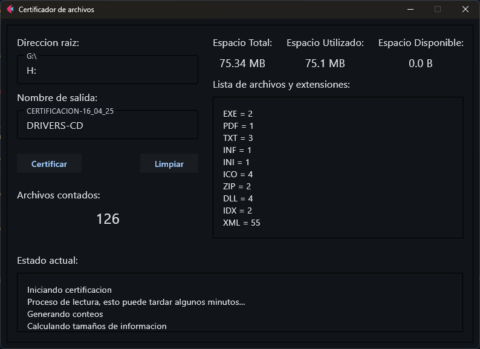
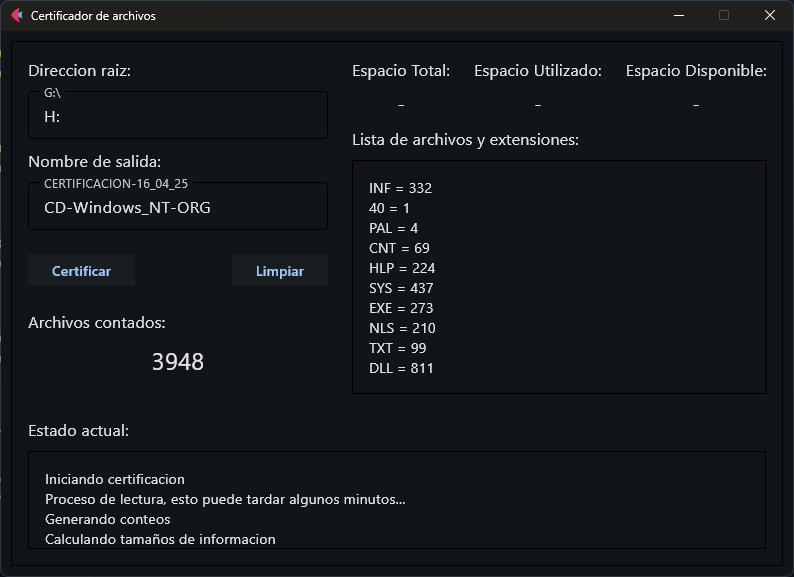
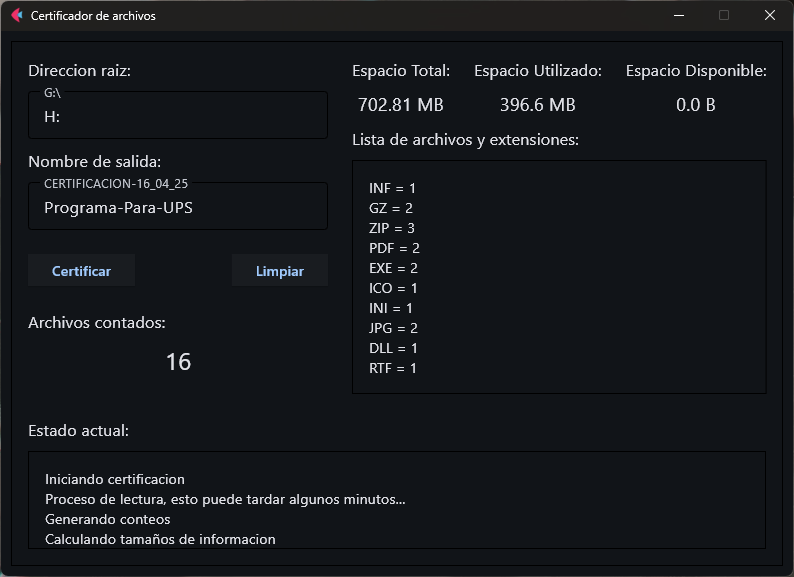
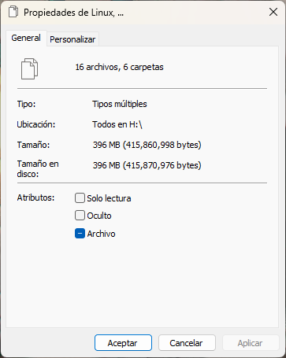

# Certificador de archivos
Analiza la ruta especificada e itera sobre los archivos contenidos para generar un registro de los archivos con su respectiva huella hash hecha con SHA256. Integra opciones como conteo total de archivos analizados, espacio total utilizado por estos, listado de extensiones y conteo por extensión, además de proveer datos sobre la unidad analizada (capacidad total, espacio ocupado por los archivos y espacio libre en la unidad). Soporta almacenamiento estructurado en repositorio JSON, base de datos SQLite3 y exportación de resúmenes a texto plano (.txt).

## Detrás del proyecto
### Contexto
Anteriormente un **órgano auditor** solía solicitar archivos expedidos por la organización para la que he trabajado, archivos que se envían aún en unidades extraíbles como USB, CD o DVD.

Estos archivos se solían enviar sin más. En la actualidad, este y otros órganos encargados de realizar auditorías han comenzado a solicitar respaldos digitales sobre el contenido de las unidades entregadas. Es por ello que se han comenzado a utilizar las certificaciones mediante huella hash; en nuestro caso particular se solicitan mediante el algoritmo `SHA256` junto con los datos mencionados en el primer párrafo. Esto con la finalidad de asegurar y mantener la integridad de la información que se entrega desde la organización.

### Justificación
El proceso planteado por el órgano en turno consistía en una serie de pasos sistemáticos y varias aplicaciones libres de por medio muy sencillas. Decidí crear una herramienta centralizada que realizara exactamente lo que se solicita con una interfaz sencilla y muy directa, para así eficientar todo el proceso, el cual cada día es más solicitado en mi área de Sistemas.

### ¿Por qué SHA256?
Actualmente es el requisito principal solicitado por el organo auditor respecto a la generación de la huella hash.

### Motivación
Realicé una investigación respecto al método utilizado para esta actividad dentro de los documentos proporcionados por el órgano auditor y me di cuenta de que, en general, era una actividad sistemática muy sencilla respecto a los requisitos solicitados, por lo que consideré que era un reto muy sencillo de trabajar con Python. Además, considerando la demanda creciente de estas solicitudes, encontré óptimo crearla no solo para mi uso en el área, sino para el uso común de las áreas que también lo requieran.

Es posible implementarla para otras organizaciones que tengan esta misma necesidad e incluso implementar otros algoritmos para la generación de la huella hash.

## Información técnica
Este proyecto consiste en una aplicación de escritorio con interfaz gráfica para centralizar los datos solicitados con un flujo de trabajo sencillo.

    <picture>
        <source srcset="./docs/screenshot-main_view.png" media="(max-width: 600px)"/>
        
    </picture>

 

### Tecnologías utilizadas
- Python, lenguaje utilizado.
- Flet, librería de interfaces modernas de escritorio.
- SQLite3, motor de base de datos relacional para persistencia estructurada.
- PyInstaller, herramienta para crear el ejecutable empaquetado.

### Características
- Generación nativa de hashes `SHA256` por bloques (streaming).
- Conteo total de archivos auditados.
- Estadísticas y clasificación por formato/extensión.
- Cálculo del espacio total ocupado por los archivos analizados.
- Detección de capacidad total, espacio utilizado y libre en la unidad de almacenamiento.
- Nomenclatura automática con fecha (`nombre-DD_MM_YY`) y sufijos secuenciales anti-colisión.
- Selector interactivo para explorar directorios en el equipo.
- Barra de progreso reactiva en tiempo real.
- Exportación manual de reportes resumidos a formato de texto plano (`.txt`).
- Persistencia configurable en repositorios JSON y base de datos SQLite3.

#### Justificación técnica
Decidí utilizar Python, pues para la primera versión rápida de prueba de concepto realicé varias certificaciones con algunas líneas de código y una interfaz CLI.

Una vez terminadas las funciones principales implementé Flet para centralizar la información y volver más accesible la aplicación mediante una interfaz gráfica clara y moderna con soporte asíncrono.

Para la entrega de reportes utilicé un formato de salida en JSON, pues esto puede ser extendible para otro tipo de lectores automatizados, implementación de APIs y facilita su importación en programas compatibles con este formato. Asimismo, integré una base de datos en SQLite3 para almacenar el histórico relacional de auditorías y un servicio de exportación a texto plano (.txt) para la entrega inmediata y legible de los resúmenes.

Por último, PyInstaller es esencial para portabilizar el programa, pues es necesario que sea más sencillo de implementar para el personal externo al área de Sistemas.

    <picture>
        <source srcset="./docs/screenshot-output-example.png" media="(max-width: 600px)"/>
        
    </picture>

 

## Flujo de trabajo

### Instalación
Preparar entorno virtual:
> `python -m venv venv`

Instalación de dependencias:
> `pip install -r requirements.txt`

Ejecución:
> `python .\main.py`

Compilar programa:
> `python .\build.py`

> [!NOTE]  
> En el archivo `config.py` es posible activar o desactivar el guardado de certificaciones en JSON (`SAVE_JSON_CERTIFICATIONS`) y SQLite3 (`SAVE_SQLITE_CERTIFICATIONS`), además de ajustar parámetros de compilación en `build.py`.

### Resultado obtenido
El siguiente es un ejemplo del resultado esperado:

    <source srcset="./docs/screenshot-output-view-example.png" media="(max-width: 600px)"/>
    

 

> [!NOTE]  
> Puede existir el caso de que el dispositivo analizado no provea información respecto a su capacidad o propiedades fisicas, como en el siguiente caso.  

    <picture>
        <source srcset="./docs/screenshot-cd_case.png" media="(max-width: 600px)"/>
        
    </picture>

 

> Eso sucede principalmente en unidades de CD o DVD, pues dependiendo del fabricante, la antigüedad, entre otros factores como codificación de los archivos y formato de la unidad.

### Limitaciones conocidas
- El tiempo que demora el análisis depende principalmente del tamaño de la muestra y la velocidad de lectura de la unidad.
- Los archivos bloqueados con permisos exclusivos del sistema operativo podrían omitirse.
- Actualmente la certificación principal está enfocada en el estándar solicitado por auditoría con el algoritmo `SHA256`.

<table style="width:100%; border:none;">
  <tr>
    <td align="center">
      <picture>
        <source srcset="./docs/screenshot-output-view-test.png" media="(max-width: 400px)"/>
        
      </picture>
    </td>
    <td align="center">
      <picture>
        <source srcset="./docs/windows-info.png" media="(max-width: 240px)"/>
        
      </picture>
    </td>
  </tr>
</table>

> [!CAUTION]  
> Puede haber una ligera discrepancia en el espacio ocupado mostrado por la aplicación y el marcado por las propiedades de Windows, ya que influyen factores como los mencionados en las limitaciones conocidas.